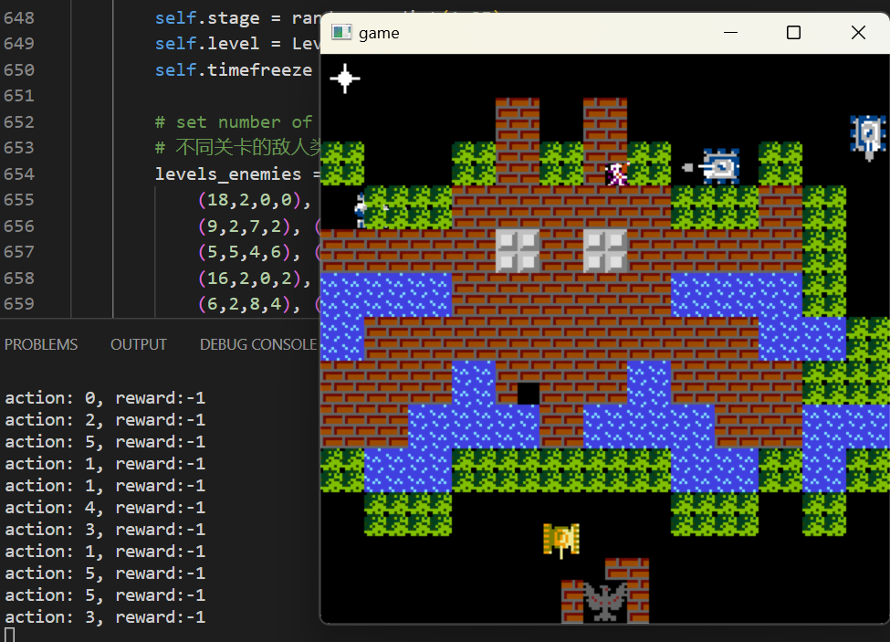
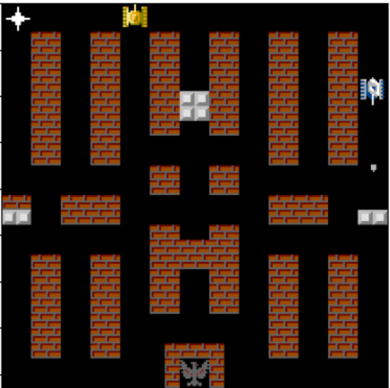
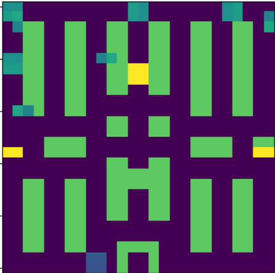
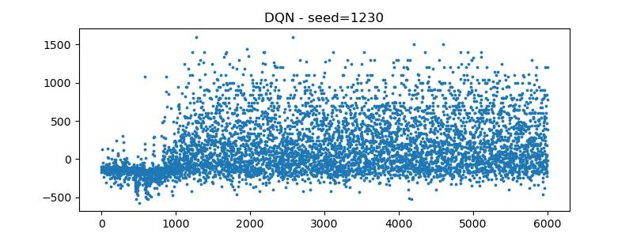

# battle-city

本项目作为 广东财经大学 IT技术创新实践 实验五 提交。



为了方便训练过程中的数据采样，本项目采用pygame设计游戏仿真环境，并在开源项目的基础上增加了适合强化学习的函数调用接口。图 1 展示了原始游戏界面，而图 2 则展示了简化版本的游戏界面。

<div style="display: flex; align-items: center;">
  
  
</div>

在简化版的界面中，一个像素对应完整版的16个像素。同时，对于坦克和子弹方向的方向进行额外调整。简化版界面的数值分配如下：

0，砖块：21，铁块：26，水：30，玩家头部：120，敌方头部：90，玩家子弹左侧：224，玩家子弹右侧：245，敌方子弹左侧：254，敌方子弹右侧：255

# DQN



# Demonstration
```
# require cv2 to visualize the captured state
python test.py --ckpt=tank6000.pth --seed=1360

# 如果想测试 tank3000.pth, 需要修改 QNetwork 类为 QNetwork_ ,去掉两层 batch_norm
```

# Forked from
* [galaamn/battle-city](https://github.com/galaamn/battle-city)
* [softpedia.com](http://linux.softpedia.com/get/GAMES-ENTERTAINMENT/Arcade/BattleCity-Tanks-59571.shtml)
* [code.google.com](https://code.google.com/archive/p/battle-city-tanks/)